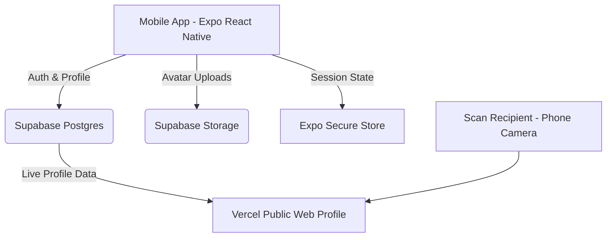

# Taply

Taply is a live, digital business card app built for developers, students, and professionals. Update your profile once, and every QR code you've ever shared updates instantly. 

Nobody needs to download an app to read your card — a standard camera scan opens your live presence on the web.

## Problem Statement
The traditional exchange of contact information relies on paper cards that quickly go stale, offer no analytics on genuine interest, and require manual follow-ups across various platforms. Taply digitizes this ritual, allowing you to hand off a dynamic profile via an auto-updating QR code that requires zero app installation from the recipient.

## Architecture



## Tech Stack & Reasoning

*   **React Native & Expo (SDK 51)**: Enables robust cross-platform mobile development (iOS/Android) from a singular, manageable codebase.
*   **Expo Router**: Provides file-based routing that seamlessly handles deep linking, auth state flows, and modular tabs.
*   **Supabase (PostgreSQL, Auth, Storage)**: A complete backend-as-a-service. Utilizes Row Level Security (RLS) to ensure users can only modify their own profiles while maintaining public read access for card scans.
*   **Zustand**: A lightweight, boilerplate-free state management library used for handling global authentication and session states.
*   **NativeWind & StyleSheets**: Hybrid styling strategy allowing rapid utility-class UI building (Tailwind) alongside rigid React Native StyleSheets.

## Features Implemented

*   **Authentication Flow**: Secure Sign Up, Log In, and Forgot Password flows via Supabase Auth.
*   **First-Time Onboarding**: Engaging 3-screen tutorial flow for new app installs.
*   **My Card Dashboard**: Instant SVG-based QR code rendering with offline support.
*   **Interactive Profile Builder**: Customizable Display Name, Pronouns, Bio, and an interactive draggable Links Manager.
*   **Avatar Management**: Upload, compress, and reliably store profile pictures.
*   **Analytics Dashboard**: Real-time insights into Total Scans, Device Breakdown (Mobile vs. Desktop), and Recent Scan History.
*   **Card Sharing Options**: Copy to clipboard, save QR as a device image, or launch native iOS/Android sharing sheets.
*   **Customization Themes**: Switch between Minimal, Lavender, Sage, and Ocean themes to globally recolor your shareable app interface and QR card.

## Setup Instructions

1. **Clone the repository:**
   ```bash
   git clone https://github.com/Heisenberg300604/Taply.git
   cd Taply
   ```

2. **Install dependencies:**
   ```bash
   npm install
   ```

3. **Environment Setup:**
   Create a `.env` file at the root of your project and add your Supabase credentials:
   ```env
   EXPO_PUBLIC_SUPABASE_URL=your_supabase_url
   EXPO_PUBLIC_SUPABASE_ANON_KEY=your_supabase_anon_key
   ```

4. **Run the App:**
   ```bash
   npx expo start
   ```

## Known Limitations

*   **Social & NFC**: Social Logins (Google/Apple) and NFC "Tap to Share" are slated for post-MVP.
*   **Web Reliance**: The web-based public profile (`/u/[username]`) requires a separate web deployment strategy (e.g., Vercel) to complete the ecosystem.
*   **Geolocation Precision**: City-level tracking in analytics relies on an external Edge Function handling IP conversion, and will report "Unknown Location" if that serverless function fails.
